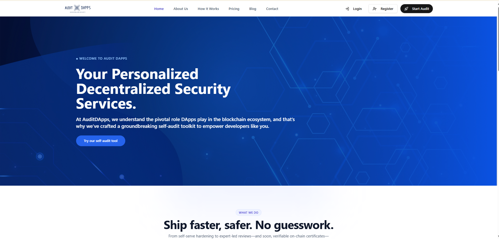
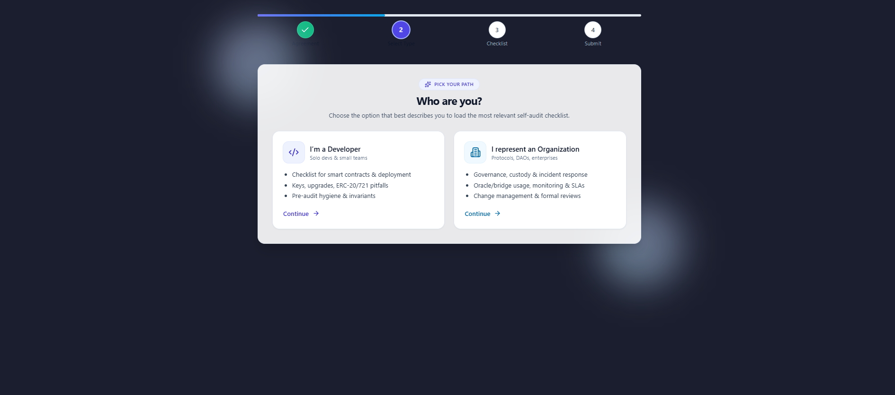
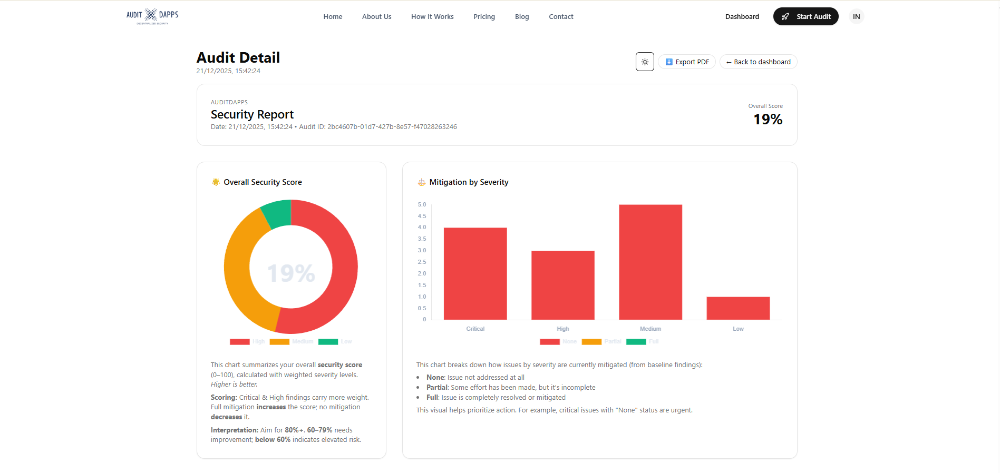

# AuditDapps

AuditDapps is a smart contract security platform that helps Web3 teams identify risks early through guided self-audits and AI-assisted analysis — before expensive third-party audits.

The goal is simple: **reduce preventable vulnerabilities and improve security readiness** for developers, startups, and protocols.

---

## Screenshots

> A quick visual overview of the product and self-audit experience.

### Landing Page


### Self-Audit Flow


### Results & Findings


---

## Why AuditDapps

Many security issues are not caused by advanced attacks, but by:
- missed best-practice checks
- rushed deployments
- lack of structured internal review
- limited access to early security expertise

AuditDapps provides:
- a structured self-audit flow
- consistent security baselines
- actionable findings and remediation guidance
- an audit trail teams can iterate on before formal audits

---

## Core Features

### Guided Self-Audit
A step-by-step checklist that adapts to:
- developer vs organisation workflows
- contract complexity
- security maturity level

### AI-Assisted Analysis
Security findings are generated using:
- predefined audit rubrics
- Solidity security best practices
- contextual analysis of user inputs

The output includes:
- risk score
- executive summary
- categorized findings (Critical / High / Medium / Low)
- concrete remediation guidance

### Audit History & Tracking
Authenticated users can:
- view previous audits
- track implemented recommendations
- maintain a security improvement record over time

### Supabase-Backed Infrastructure
- authentication
- persistence
- edge functions
- role-based access

---

## Tech Stack

### Frontend
- React
- TypeScript
- Tailwind CSS
- Vite
- Framer Motion
- Vitest (testing)

### Backend & Platform
- Supabase (Postgres, Auth, Storage)
- Supabase Edge Functions (Deno)
- OpenAI API (analysis generation)

### Architecture
- client-side SPA
- serverless edge execution
- strict TypeScript boundaries
- environment-based configuration

See [`ARCHITECTURE.md`](./ARCHITECTURE.md) for a deeper breakdown.

---

## Repository Structure

```
.
├── src/
│   ├── components/
│   ├── pages/
│   ├── routes/
│   ├── scoring/
│   ├── utils/
│   └── services/
├── supabase/
│   └── functions/
├── docs/
├── ARCHITECTURE.md
├── CONTRIBUTING.md
├── SECURITY.md
├── RELEASE.md
└── README.md
```

---

## Getting Started (Local Development)

### Prerequisites
- Node.js 18+
- npm
- Supabase project (for full functionality)

### Setup
```bash
git clone https://github.com/Auditdapps/auditdapps.git
cd auditdapps
npm install
cp .env.example .env
npm run dev
```

---

## Security

If you discover a security issue, **do not open a public issue**.

Please see [`SECURITY.md`](./SECURITY.md) for responsible disclosure instructions.

---

## Contributing

Contributions are welcome.

Please read [`CONTRIBUTING.md`](./CONTRIBUTING.md) for:
- branching strategy
- commit conventions
- development guidelines

---

## Releases

Release history and versioning notes are documented in [`RELEASE.md`](./RELEASE.md).

---

## Technical Deep Dives

- Hybrid Smart Contract Security: Combining Static Analysis with AI-Assisted Audits  
  https://luckaty.hashnode.dev/hybrid-smart-contract-security-combining-static-analysis-with-ai-assisted-audits

---

## License

This project is licensed under the **MIT License**.  
See [`LICENSE`](./LICENSE) for details.

---

## Project Status

AuditDapps is under active development.

Planned improvements include:
- static analysis integration (e.g. Slither)
- richer risk scoring models
- exportable audit reports
- organisation dashboards

---

## Maintainers

AuditDapps is developed and maintained by the AuditDapps engineering team.

Lead Engineer: **Blessed (luckaty)**
# AuditDapps

AuditDapps is a smart contract security platform that helps Web3 teams identify risks early through guided self-audits, deterministic static analysis, and AI-assisted review — before expensive third-party audits.

The goal is simple: reduce preventable vulnerabilities and improve security readiness for developers, startups, and protocols.

---

## Screenshots

A quick visual overview of the product and self-audit experience.

Landing Page


Self-Audit Flow


Results & Findings


---

## Why AuditDapps

Many security issues are not caused by advanced attacks, but by:
- missed best-practice checks
- rushed deployments
- lack of structured internal review
- limited access to early security expertise

AuditDapps addresses this gap by providing:
- a structured self-audit flow
- consistent security baselines
- deterministic static analysis
- AI-assisted explanation and remediation guidance
- an audit trail teams can iterate on before formal audits

The platform is designed to complement, not replace, professional security audits.

---

## Core Features

### Guided Self-Audit
A step-by-step checklist that adapts to:
- developer vs organisation workflows
- contract complexity
- security maturity level

### Static Analysis (Slither)
AuditDapps integrates Slither, a widely used open-source static analysis framework for Solidity.

Static analysis:
- runs in an isolated backend service
- produces deterministic, explainable findings
- detects issues such as reentrancy, unsafe calls, version risks, and logic flaws
- is displayed separately from AI output to preserve trust and transparency

### AI-Assisted Analysis
AI is used only after deterministic analysis to:
- summarise overall security posture
- explain impact and exploit scenarios in plain language
- suggest concrete remediation steps
- prioritise findings using consistent severity levels

AI output is constrained to a strict JSON schema and never treated as ground truth.

The output includes:
- security score (0–100)
- executive summary
- categorised findings (Critical / High / Medium / Low)
- actionable remediation guidance

### Audit History & Tracking
Authenticated users can:
- view previous audits
- track implemented recommendations
- maintain a security improvement record over time

### Supabase-Backed Infrastructure
- authentication
- persistence
- edge functions
- role-based access

---

## Architecture Overview

AuditDapps follows a layered security analysis model:

1. User input & self-audit
2. Deterministic static analysis (Slither)
3. AI-assisted explanation and summarisation
4. Human review and iteration

This separation ensures that:
- static findings remain verifiable
- AI does not hallucinate vulnerabilities
- explanations remain grounded in real signals

See ARCHITECTURE.md for a deeper technical breakdown.

---

## Tech Stack

Frontend
- React
- TypeScript
- Tailwind CSS
- Vite
- Framer Motion
- Vitest (testing)

Backend & Platform
- Supabase (Postgres, Auth, Storage)
- Supabase Edge Functions (Deno)
- FastAPI (Python) for static analysis service
- Slither (static analysis)
- OpenAI API (analysis generation)

Architecture Principles
- client-side SPA
- isolated backend services
- deterministic-first security analysis
- strict TypeScript boundaries
- environment-based configuration

---

## Repository Structure

.
├── src/
│   ├── components/
│   ├── pages/
│   ├── routes/
│   ├── scoring/
│   ├── utils/
│   └── services/
├── services/
│   └── slither-api/
├── supabase/
│   └── functions/
├── docs/
├── ARCHITECTURE.md
├── CONTRIBUTING.md
├── SECURITY.md
├── RELEASE.md
└── README.md

---

## Getting Started (Local Development)

### Prerequisites
- Node.js 18+
- npm
- Docker (for static analysis service)
- Supabase project (for full functionality)

---

### 1) Start the Slither Static Analysis API

The Slither service runs as an isolated backend to avoid running security tooling in the browser.

Command:
docker compose up --build slither-api

Once running, the API is available at:
- http://127.0.0.1:8001/health
- http://127.0.0.1:8001/analyze

---

### 2) Start the Frontend

Commands:
npm install
npm run dev

Frontend runs at:
http://localhost:5173

---

### 3) Environment Variables

Create a local environment file (do not commit this):

.env.local
VITE_SLITHER_API_URL=http://127.0.0.1:8001

---

### 4) Quick Static Analysis Test (PowerShell)

$body = @{
  source_code = @"
pragma solidity ^0.8.20;

contract Bank {
  mapping(address => uint256) public balances;

  function deposit() external payable {
    balances[msg.sender] += msg.value;
  }

  function withdraw() external {
    uint256 amount = balances[msg.sender];
    (bool ok,) = msg.sender.call{value: amount}("");
    require(ok);
    balances[msg.sender] = 0;
  }
}
"@
  filename = "Reentrancy.sol"
} | ConvertTo-Json

Invoke-RestMethod `
  -Uri http://127.0.0.1:8001/analyze `
  -Method POST `
  -ContentType "application/json" `
  -Body $body

---

## Security

If you discover a security issue, do not open a public issue.

See SECURITY.md for responsible disclosure instructions.

---

## Contributing

Contributions are welcome.

See CONTRIBUTING.md for:
- branching strategy
- commit conventions
- development guidelines

---

## Releases

Release history and versioning notes are documented in RELEASE.md.

---

## Technical Deep Dives

Hybrid Smart Contract Security: Combining Static Analysis with AI-Assisted Audits  
https://luckaty.hashnode.dev/hybrid-smart-contract-security-combining-static-analysis-with-ai-assisted-audits

---

## License

This project is licensed under the MIT License.  
See LICENSE for details.

---

## Project Status

AuditDapps is under active development.

Planned improvements include:
- deeper static analysis coverage
- finding deduplication and confidence weighting
- richer risk scoring models
- exportable audit reports
- organisation dashboards

---

## Maintainers

AuditDapps is developed and maintained by the AuditDapps engineering team.

Lead Engineer: **Blessed (luckaty)**
